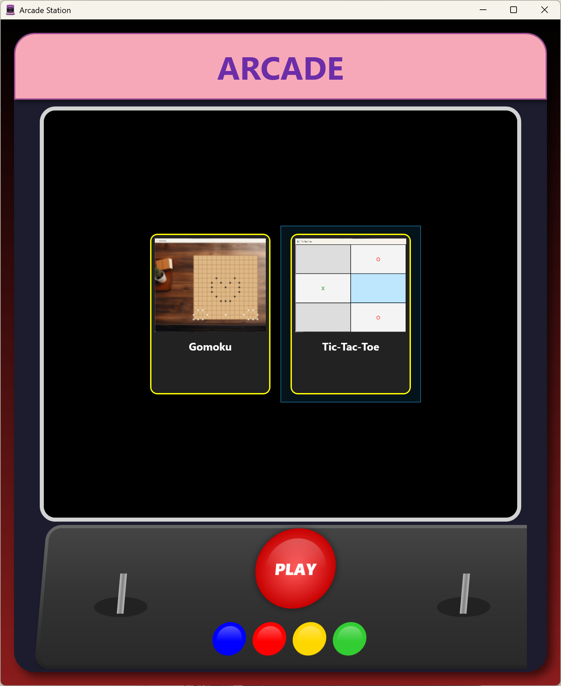
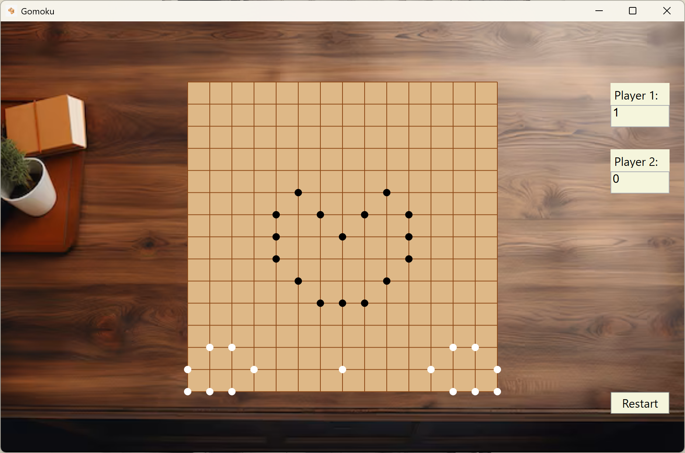
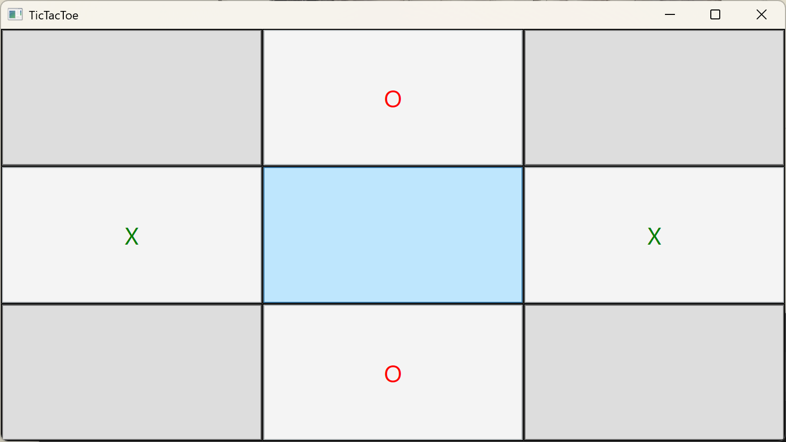

# Arcade Station

> [!WARNING]
> I do not own any of the music, so no re-distribution or sell on any of them

## Design
**Classical** Arcade studio design with **fimilar** music, with multiple games ready-to-play, constantly updating on my free time.

## Gomoku
This is a fully functional Gomoku game with Score Counting and Relaxing music

*Traditional* Gomoku design meets C#, and that is lightning fast⚡  
Special pick relaxing music to enjoy the win

## Tic-Tac-Toe
A minimal designed Tic-Tac-Toe game in C#, _Simple but strong_  

## Idea
*Enjoy the Childhood memory with friends again!*  

Feel free to raise a PR or let me know if you want any improvements!  
